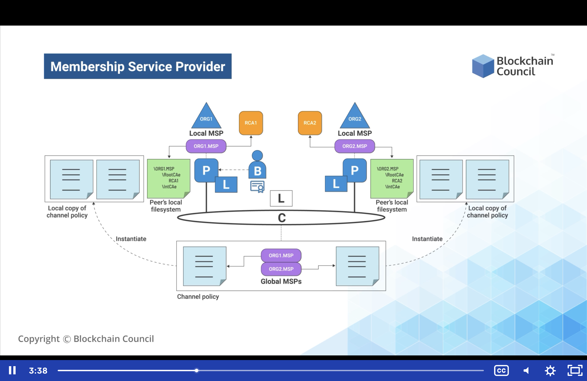

# Hyperledger Fabric - Membership Service Provider

1.  Membership Service Provider (MSP) is the pluggable interface which supports variety of credentials architectures.
    -   MSP supports all the Certificate Authorities (CAs) or CA-servers being used behind the MSP
    -   MSP is the interface that requests the server because the clients and SDKs can't or don't approach the CA servers directly. Instead, they go to the MSPs which internally has the specific verifications and validations running. Only after they are fulfilled, the request is sent to the CA for generation of certificate.
2.  The Membership Service Provider, MSP involves key aspects for its functioning:
    -   MSP Has four different vital concepts
        -   Concrete identity format
            -   It provides with a particular identity format. Whether using a default or custom defined identity format, both are possible with hyperledger fabric.
            -   For instance, an identity format could be just a normal user with a first name, last name, phone number and email, or it could include addresses and security questions too. This will give a real identity format
        -   User credential validation
            -   Validation is an essential element in hyperledger fabric and earlier also discussed how the validation framework is running at different levels of hyperledger fabric.
            -   Validation is provided by running checksums behind it. This validates all the user credentials as per the requirement. 
            -   Validation can also include the 2Factor Authorization and email confirmation
                -   For instance, we can provision a chaincode which has a 2 factor authorization and email confirmation over our MSP through which we can run a validation process for the user.
        -   User credential revocation
            -   Revocation system is an essential part of the certificate authority. 
                -   For example, if there are vendors who are getting connected to the private blockchain ith a one year contract, then we can create and revoke the certificate after one year. We don't have to revoke manually. We can add the revocation command through the SDKs. Or we can put the revocation with that certificate itself; specifying that it is a time-based certificate where cancellation will happen automatically once the time period exhausts.
        -   Signature generation and verification
            -   Each peer signs the transaction with their respective certificate before sending it to other peers. The other peers verifies the signatures with the helpf of the MSPs.
3.  A hyperledger fabric blockchain network can be governed by one or more MSPs, which provides modularity of membership operations, and interoperability across different membership standards
    -   Hence, there can be a possibility of different organizations running on one single blockchain.
        -   Assume we are creating a solution for a bank, when we have multiple banks connected to one single blockchain and there is one MSP for each bank.
        -   This way, each bank can have their format of identity, validation and verification which can be used to interact with the blockchain.
        -   It is a more modular approach to membership operations and inter-operability across different standards which are being used. Therefore, some banks can have a certain standard of user format, and another bank, some additional measures of user format. Both of them are fulfilled by using MSP and we can divide them as per requirement. Thus it maintains the modular approach of hyperledger fabric throughout.
            -   It also helps to create a solution which is pluggable and we can replace anything possible in the hyperledger fabric system.

            ## Diagram of a standard architecture of the MSP.
            

            -   There are two organizations, ORG1 and ORG2
            -   Global MSPs OR1.MSP and ORG2.MSP run behind the organizations above
            -   Every time peers join from different organizations, the global MSPs containing ORG1.MSP and ORG2.MSP generate the certificates accordingly.
                -   This certificate is then instantiated by the peer who installs it in their local file system to validate and verify the different blockchain processes that are happening within the system.
                -   So we have 2 organizations. Local MSPs who are part of the global MSPs and the same MSPs are used to generate the same certificates based upon the different organizations. These certificates could be the same or different formats depending on business requirements when connected to the channel.
                -   The channel is represented by C in the middle of the diagram above
                -   The peers are tagged as P connected to the channel
                -   Certificates are stored as files on the file system which are being stored with the peers themselves
            -   The diagram above explains in a simple way, how the MSPs provide certificates for the hyperledger system

## How to use MSP?

1.  The MSP must be installed on each channel peer to ensure that transaction requests that are issued to the peer originate from an authenticated and authorized user identity
    -   A local MSP must be present on each peer which then connects to the global MSP for the organization. This peer holds the organizational file system or each of them knows that these are the recognized certificates by the global MSP. 
        -   Suppose there is a global MSP which generates 50 certificates for 50 different participating peers. Then every peer will have a local MSP which will give the details that these 50 certificates are recognized within the private blockchain. 
        -   If out of these 50 certificates there are any of which are not recognized, then the peer itself can reject the kind of transaction, changes or updates over the state of the blockchain. 
        -   This is how an MSP is governed.
2.  A MSP Identifier or MSP ID needs to be specified for each MSP, in order to reference that MSP in the network which must be unique per MSP instance.
    -   About the MSP, we directly use this unique ID for every instance of the local MSPs which are running.
3.  If a default implementation of MSP is chosen, a set of parameters are required to be specified to allow for identity validation and signature verification, this includes:
    1.  **A list of self-signed (X.509) certificates to represent intermediate CAs**
        -   So it is clear that there is no root CA at the point of local MSPs. Root CAs are completely fabricated from the system and we use intermediate CAs to interact with different MSPs
    2.  A list of x.509 certificates to represent the administrators of this MSP
        -   This is a cryptographic standard. 
        -   A list of X.509 certificates is present with the MSPs and they know which certificates that has been provisioned and which peers have been authorized to connect to the blockchain
    3.   A list of valid members of this MSP
    4.   A list of certificate revocation lists (CRLs)
        -   Provide information on which certificate has been revoked. 
        -   Certificates don't need to be deleted, instead the CRL can be checked for example:  
            -   if file certificates have been revoked
        -   Certificates don't need to be validated because they have already been rejected and are not presented in the blockchain
    5.   A list of X.509 certificates to represent intermediate TLS CAs
        -   TLS is the Transport Layer Security CAs
    6.   A list of self-signed (X.509) certificates of TLS root of trust for TLS certifiate
