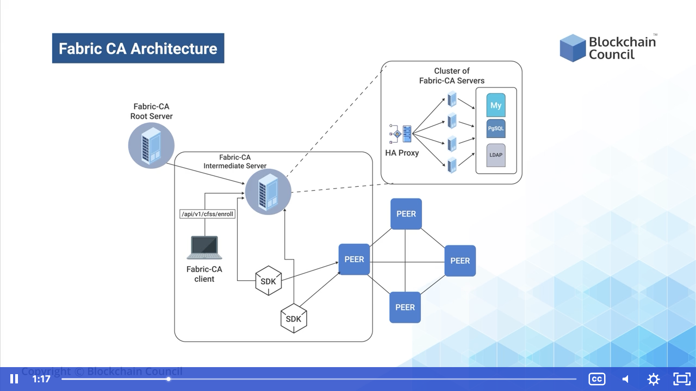

# Hyperledger Fabric CA - Certificate Authority

1.  Hyperledger Fabric CA is a Certificate Authority for Hyperledger Fabric which acts as a tool using which you can generate certificates
    -  Hyperledger Fabric uses a library to create certificates but the library can be altered to use custom libraries like OpenSSL
2.  You can generate certificates by specifying the username, password and affiliations which is called Enrollment
    -   Once the certificate is generated, it is known as Enrollment
    -   The Enrollment provides us with multiple functionalities such as:
        -   Certificate renewal and revocation
        -   Registration of identities, or connects to LDAP as the user registry
        -   Issuance of new Enrollment certificates
3.  Hyperledger Fabric CA consists of both components, a client and a server

## Fabric Certificate Authority Architecture

1.  Usually all certificate authorities have a similar architecture
2.  The root fabric CA generates the root certificate.
    -   With the help of the certificate, you can sign another certificate, which is the intermediate certificate
    -   This intermediate certificate will now generate certificates for different users, computers and nodes which will connect to the blockchain
    -   The Faric CA Client is also connected to the intermediate server. This also isolates the root server from all abstraction layers, ensuring that it works alone and its only responsibility remains is to sign the intermediate server which will further provide all the certificates. Such a setup also gives us the functionality where the intermediate server is exposed to any threat environment, the root server will not need to be changed, but only the intermediate keys. The same root keys can be used to generate the intermediate root keys and similarly all the keys after that, can also be regenerated. It ensures a certain amount of version control over the certificate authority process.

## Fabric CA Architecture
1.  The Fabric-CA root Server is the root node of the entire tree
    -   It helps to create a root certificate which is then used to manage all the other certificates within the organization
    -   We can interact with the Fabric-CA Server using the:
        -   Fabric-CA Client or
        -   Fabric SDKs
            -   Here, clients are the direct entities that can help to generate certificates manually for any peer or node. If a node or any peer is running an application on top of that, then they can use SDKs to request certificates
            -   The client routes the entire certificate generation to an HA Proxy endpoint which load balances traffic to one of the fabric-CA server cluster members
