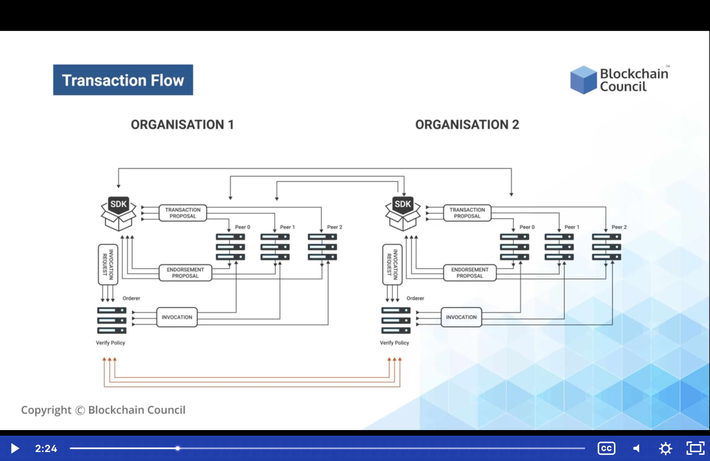
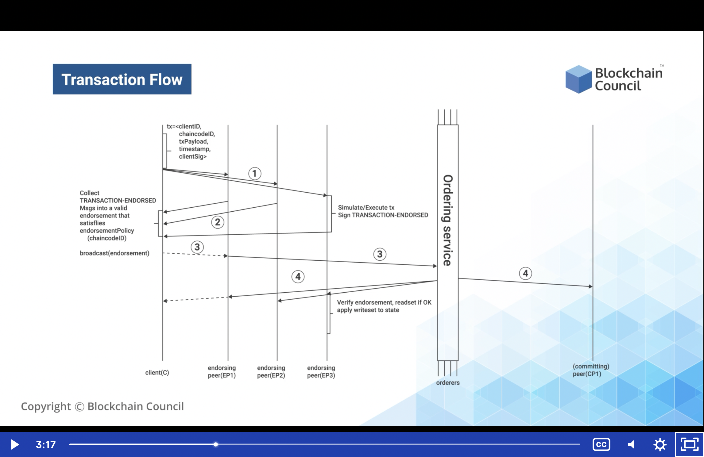
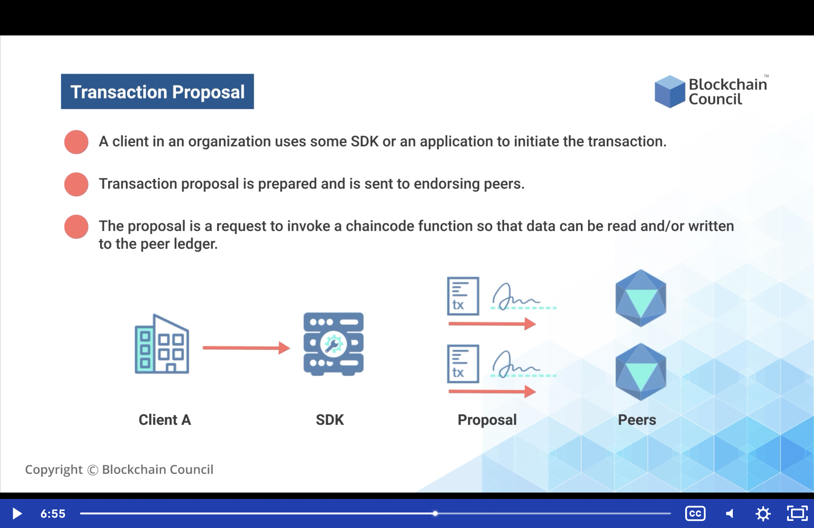
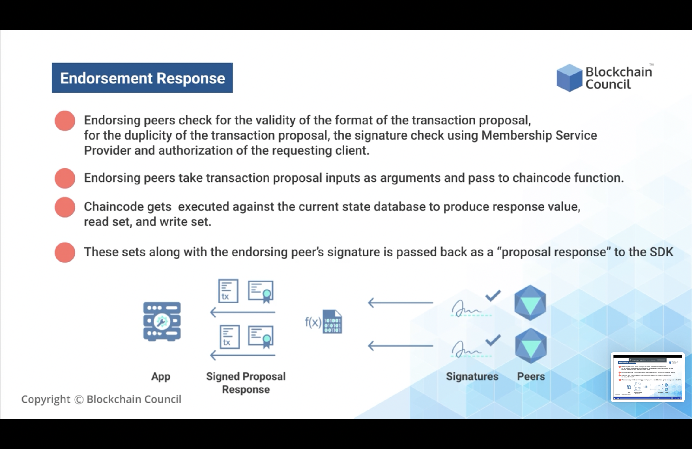
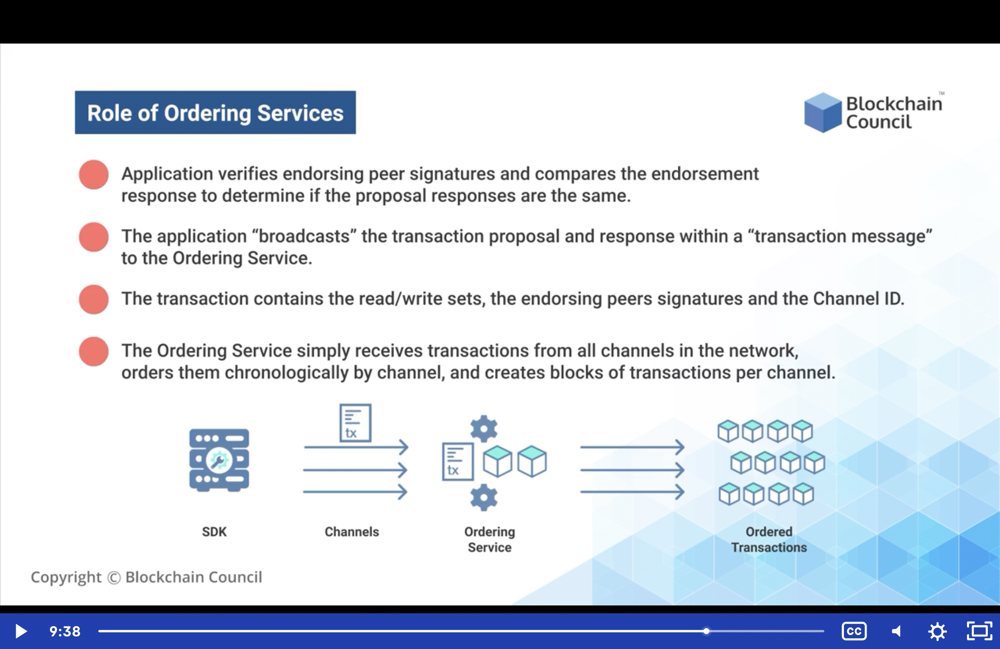
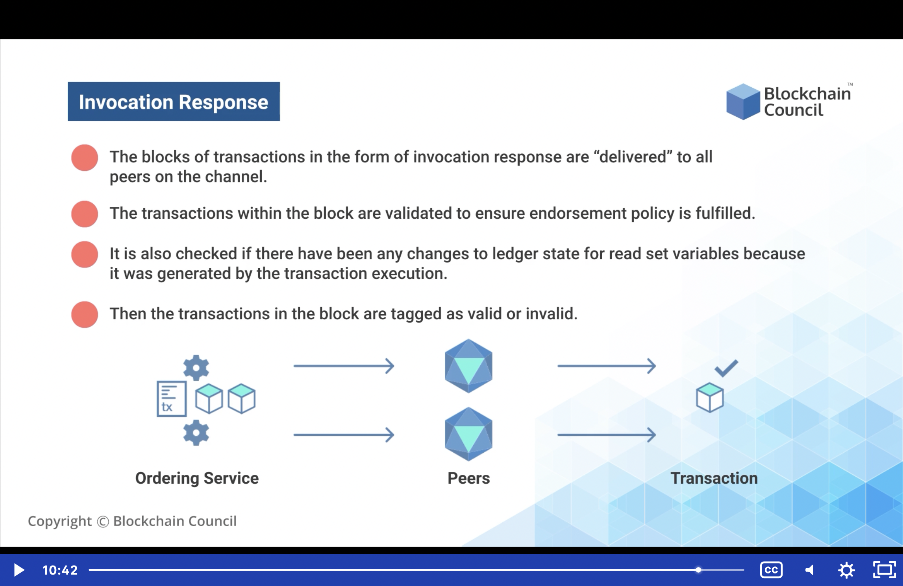
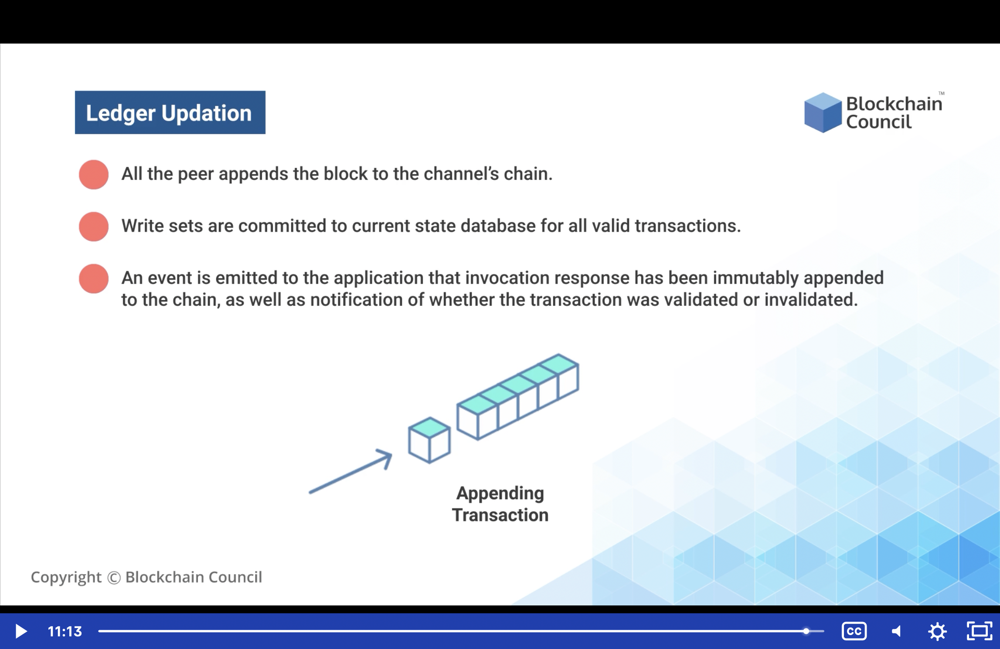

# Hyperledger Fabric Transaction Flow

1.  Channel is properly setup and running
2.  A Certificate Authority (CA) is setup and running
3.  The application user has registered and enrolled with the organization's certificate authority (CA) and received back necessary cryptographic material, which is used to authenticate to the network
4.  The chaincode is installed on the peers and instantiated on the channel
5.  The chaincode contains logic defining a set of transaction instructions and agreed upon price for an asset
6.  An endorsement policy has also been setup for this chaincode, stating that all peers must endorse any transaction

## Transaction Flow Breakdown

1.  Transaction proposal: 
    -   is sent to the endorsing peers by the Client
2.  Endorsement Response:
    -   Endorsement response are sent back to the Client by the endorsing peers
    -   Client sends Endorsement Response to the Ordering Services
3.  Role of Ordering Service:
    -   Ordering Services updates the ledger using the Endorsement Response
    -   Ordering Services receives response from Committing Peers
    -   The response is broadcasted to the other peers informing them the transaction has been committed and that the ledger has been updated
4.  Ledger Update:
    -   Lastly, connected peers revise their ledger to be in sync with the channel ledger

 

## Transaction Flow - Orderer Services

<!--  -->

## Transaction Proposal

1.  A client in an organization uses some SDK or an application to initiate the transaction
2.  The Transacton proposal is prepared and is sent to endorsing peers
3.  The proposal is a request to invoke a chaincode function so that data can be read and/or written to the peer ledger

## Endorsement Response

1.  After the transaction has been sent to the endorsement peers, the endorsing peers check for the validity of the format of the transaction proposal, for the duplicity of the transacton proposal, the signature check using Membership Service Provider and authorization of the requesting client.
2.  In case the transaction has a wrong client signature, or one that is not present with the Membership Service Provider, then, the client is not authorized to create a transaction over the hyperledger system. Thus it's necessary that the Client has a certificate issued by the MSP. And it is mandatory that the client use this issued certifiate to sign the transaction.
3.  After that, the endorsing peers take the transaction proposal inputs as arguments and forward them to chainode function. By input arguments it means the endorsing peers execute a chaincode set over the copy of the ledger.
4.  Once the Chaincode gets executed against the current state database to produce response value, read set and write set. For example, if using MySQL and have created an ID, then we know there is a user table with an identity 100. After that, a new entry is formed in the user table with the identity as 101.
5.  Similarly, in this database, we are not directly updating the ledger. Instead we are checking if after 100, 101 is coming or not. It updates a copy of the ledger after the 101st entry has come in, and it puts this entry as a read and write set within the transaction proposal.
6.  Then the Endorsing peers signs this transaction using their certificate. Once it is approved, the proposal response is sent to the client again.

## Role of Ordering Services

1.  Once the Client receives the endorsed transaction, it verifies endorsing peer signatures and compares the endorsement response to determine if the proposal responses are the same.
2.  The Client "broadcasts" the transaction proposal and endorsement response within a "transaction message" to the Ordering Service.
    -   The transaction contains the read/write sets, the endorsing peers signatures and the ChannelID.
3.  Ordering service updates the ledger by simply creating read and write sets of the transaction along with the new state of the blockchain on the ledger
    -   The Ordering Service broadcasts the update to all the peers who are connected to the blockchain.
4.  The Ordering Service receives the transactions from all channels in the network, orders them chronologically by channel, and creates blocks of transactions per channel.

## Invocation Response
1.  Broadcasting of transactions can be termed "Invocation Response"
    -   After the ordering service puts a new block of transactions over the blockchain, these blocks of transactions in the form of "invocation response" are delivered to all the peers on the channel
    -   These are delivered through a new set of protocol setup by hyperledger called "GOSSIP" protocol
2.  The transactions within the block are validated to ensure endorsement policy is fulfilled
    -   After receiving the latest updates from the ledger, the peers also validate whether the transactions are followiing the endorsement policies or not.
    -   If the transactions are not following the endorsement policies, then the peers can even reject the new updates,  informing on the ledger that they are not following the endorcement policy. Hence, the new update is rejected.
3.  Whether transactions are valid or invalid, in either case, the state of the ledger is updated.
    -   It is also checked if there have been any changes to ledger state for read set variables because it was generated by the transaction execution
    -   If the transaction is invalide, the state of the ledger will be represented
4.  It is through this method that Hyperledger maintains the history and transparency in all the transactions

## Ledger Update
1.  All the peers append the block to the channel's chain.
2.  Write sets are committed to current state database for all valid transactions.
3.  After that, an event is emitted to the application that invocation response has been immutably appended to the chain, as well as notification of whether the transaction was validated or invalidated
    -   It also notifies all the peers connected to the channel about the current state of the blockchain ledger.
    -   Hence, every peer syncs to the blockchain ledger and updates to the new state of the ledger via the transaction proposal

