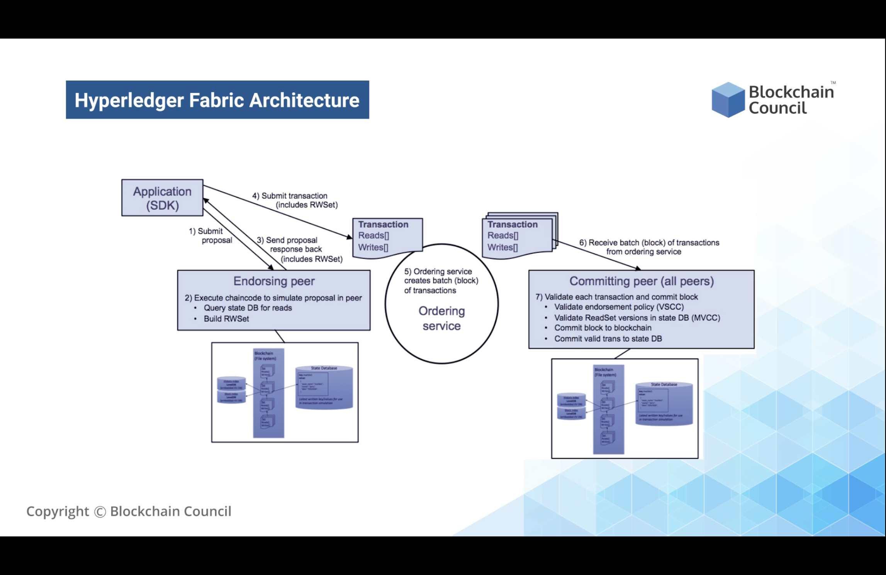
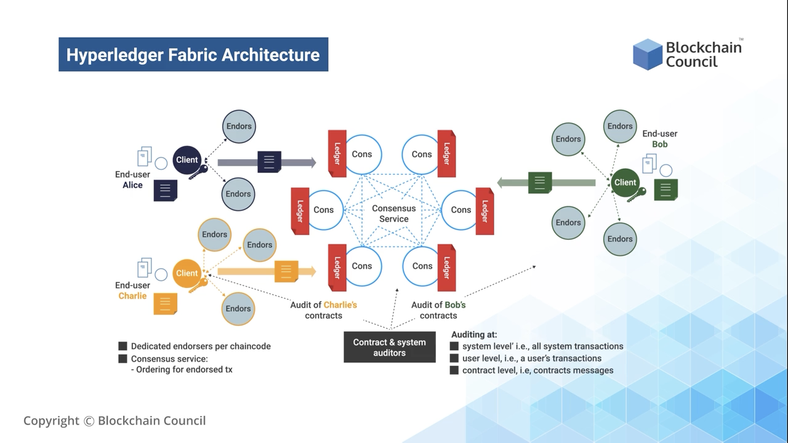

# Hyperledger Fabric

## High level Hyperledger Fabric Architecture
1.  Application (SDK): submits a proposal
2.  Endorsing Peer: Execute chaincode to simulate proposal in peer
    -   Query state DB for reads
    -   Build Read/Write set
3.  Endorsing Peer: sends proposal (including Read/WriteSet) response back to SDK
4.  Application (SDK): Submits transaction (includig Read/WrtieSet) to Ordering Service
5.  Ordering Service: Creates block of transactions and send them to committing peers
6.  Committing Peers: Receive batch (block) of transactions from ordering service
7.  Committing Peers: Validates each transaction and commit block
    -   Validate endorsement policy (VSCC)
    -   Validate ReadSet versions in state DB (MVCC)
    -   Commit block to Blockchain
    -   Commit valid transaction to state DB

## Detailed level Highledger Fabric Architecture
1.  When a user uses a blockchain application through the user interface, the request on the application does not go to the blockchain directly
2.  The application creates a future update proposal and submits a request for confirmation over the blockchain
3.  With the request, the application seek to modify the data stored in the blockchain, or the current state of the blockchain
4.  At present, the blockchain is at a stage where all the data has been sent; and we want to add one more transaction on top of that
5.  For this, we will modify the state of the blockchain
6.  The first step is that the application creates a proposal and sends to endorsing peers
7.  Endorsing peers are peers only with special privileges
8.  The job of the peers is to verify and validate the transaction which is coming in
9.  This is done through a simple process
10. Everyone connected to hyperledger fabric blockchain has a peer that holds the state of their blockchain
11. Similarly, endorsing peers have their state of the blockchain. They execute the transaction which is coming in along by simulating it over a copy of the ledger
12. Simulating means that they don't directly change the state of the blockchain.
13. But instead, they hold a copy of the state of the blockchain and then implement the transaction proposal on that copy of the blockchain
14. If the endorsing peer is executed directly over a blockchain, then they are going to change the state of the blockchain as a whole which is available to the complete network
15. Therefore, the endorsing peers hold a copy of the blockchain state and they put the transaction on top of that without updating it.
16. In hyperledger blockchain, data storage happens in a way that every transaction that is coming in or every block that is coming in are in key-value pairs.
17. This implies that every new transaction which is happening will be a key-value pair making a complete hyperledger database a key-value database
18. Consequently, endorsing peers hold the copy of the blockchain state, execute the transaction on top of the copy, and once the transactions are implemented, the read/write set of the keys is changed automatically
19. Let's agree initially, that the read set of keys is about 100 blocks and the write set was at 101, so 100 blocks is the last entry inside the blockchain. As soon as a new transaction is executed, the read set stats changes to 101 and the write set changes to 102. Hence the blockchain state is not changed from 100 to 101 directly, but by executing the transaction over a copy of the blockchain, we obtain a read set of the proposed state.
29. This means we get to see the change happening in the blockchain from 100 to 101. So the read set and the write set are built with it.
30. It provides a complete framework where the blockchain state is not updated directly. Instead, the read set and the write set is obtained by updating a copy of the blockchain state. In the end this results in getting the new values on top of it.
31. Once the endorsing peers check that the transactions are in the correct order, including the blocks, then they validate the transaction.
32. After verifying it, the endorsing peers sign the proposal with their certificate 
33. Any one who is connected to the hyperledger blockchain has their certificate issued by the Membership Service Provider.
34. Similarly, an endorsing peer has their certificates; and after signing the transaction proposal they send it back to the Application (SDK)
35. The signed response also includes the read set, the write set and future changes.
36. These are added to the transaction proposal before sending it back to the Application (SDK)
37. Once the application receives this transaction, it checks for the satisfaction of the endorsement policies. And if the endorcement policies are met it sends the transaction to the Ordering Server or Service (Orderer)
38. Ordering server is the central entity which updates the state of the blockchain.
39. The Ordering servers receives the transactions and orders them into a block. It checks what kind of reads and writes are going to be updated within the transaction and also checks whether it is a part of the correct block or not.
40. Once everything is examined, the Ordering Service puts this complete transaction change as a block over the blockchain.
41. Thus, it is the Ordering Service  which updates the Blockchain States. It means that once the Blockchain state is renewed and the transaction block is refreshed, then all the peers which are connected to the Blockchain will get the new read set and the write set for the Blockchain state through GOSSIP Protocol working behind the scene.
42. Finally, they will update their states for the new changes which are coming in. Hence, this shows that the architecture of the Hyperledger Fabric is modular in nature. It is not dependent on one single entity to make the changes for the Blockchain. Preferably, one entity needs to verify and validate the blockchain. That is the Endorsing peer which creates the read/write set. 
43. The other entity is the Ordering Service, which is responsible for creating the blocks and adding them over the Blockchain.
44. After that, the other peers will communicate with the Blockchain and receives the new transaction within their state through the GOSSIP protocol.
43. This is how the architecture works in Hyperledger Fabric.